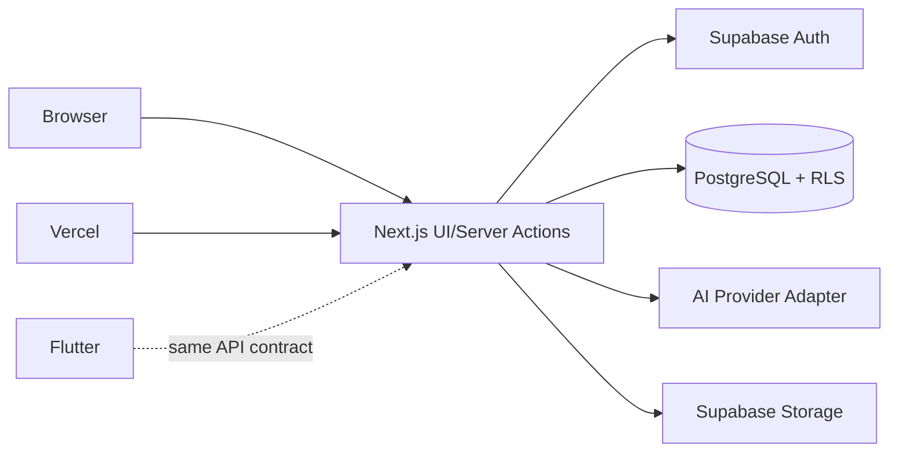

# OHGYEOL 아키텍처

## 결정 구조

Next.js App Router + TypeScript를 웹 MVP로 사용한다. UI는 Server Component 우선, 상호작용만 Client Component로 분리한다. Supabase Auth/PostgreSQL/Storage와 Vercel을 사용하며 Flutter가 같은 API 계약을 소비할 수 있게 도메인 로직을 서버 모듈로 둔다.

## 경계·환경·인증

브라우저 공개 변수는 `NEXT_PUBLIC_SUPABASE_URL`, `NEXT_PUBLIC_SUPABASE_PUBLISHABLE_KEY`뿐이다. 서버가 세션 확인→권한 확인→입력 검증→DB 조회를 수행한다. 사용자 ID는 `auth.getUser()`에서 도출한다. 서버 전용: `SUPABASE_SERVICE_ROLE_KEY`, `AI_API_KEY`, `AI_MODEL`. Vercel preview/production과 Supabase 프로젝트를 분리한다. 현재는 연동 의존성이 없어 **추가 검증 필요**.

추천은 DB 후보 검색→`levelScore`/`candidateScore`→후보 제한 AI rerank→ID 검증이며 AI 장애 시 deterministic 결과다. 예상 폴더는 `src/lib/supabase`, `src/lib/domain`, `src/lib/ai`, `supabase/migrations`, `supabase/seed`다. 로그에는 request id·오류 code만 남기며 chat/RAG/vector DB/결제는 MVP에 추가하지 않는다.
